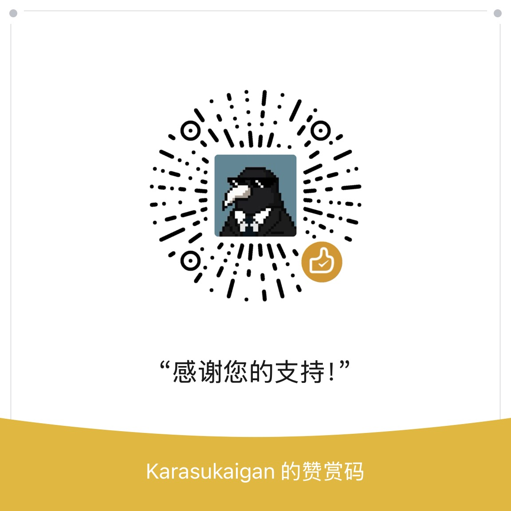

# Game Trainer Manager

English | [简体中文](./README_ZH.md)


**Game Trainer Manager** is a lightweight software designed for managing `.exe` format game trainer files. It provides functions for downloading, saving, deleting, and more. The application supports both Simplified Chinese and English languages. It is completely free and open-source (please do not use it for commercial purposes).

## Features

- Manage `.exe` format game trainers
- Download, save, and delete trainers
- Multi-language support (Simplified Chinese and English)
- Lightweight
- Free and open-source


## Installation

You can download the software in two ways:

1. **Directly from Releases:**
   - Go to the [Releases](https://github.com/Karasukaigan/game-trainer-manager/releases) section and download the installer.

2. **Clone the repository and run locally:**
   - Clone the repository to your local machine:
     ```bash
     git clone https://github.com/Karasukaigan/game-trainer-manager.git
     ```
   - Navigate to the project root directory and run the following commands:

     ```bash
     # Create a virtual environment named 'venv'
     python -m venv venv

     # Activate the virtual environment
     venv\Scripts\activate

     # Install the required dependencies
     pip install -r requirements.txt

     # Run the application
     python .\main.py
     ```

## Update Methods

There are three files that need to be updated frequently:

- trainers_list.csv
- game_names_merged.csv
- abbreviation.csv

These three files are located in the `app/resources` directory. The `trainers_list.csv` records information related to the trainers, `game_names_merged.csv` records the English and Chinese names of the games, and `abbreviation.csv` records the abbreviations or aliases of the game names.

You have two optional update methods:

1. **Automatic Update**: The `config.ini` records the last update time. If it has been more than 2 days without an update, the application will update the above three files upon startup.

2. **Manual Update**: If the automatic update fails due to poor network conditions, you need to click on **File** > **Update Trainers List** from the menu bar after the network improves to perform the update.

## Debug Mode

Locate the `config.ini` file in the project's root directory or the software's `_internal` directory, then change
```
debugmode = false
```
to
```
debugmode = true
```
to enable debug mode.

## Support the Author


## About the Official Version

The official version of Game Trainer Manager has removed the crawler feature from the beta version, so it will not impose an additional burden on the servers of FLiNG Trainer. When users download the trainer, the software will open the download link using the default browser instead of initiating a request directly through the program. When searching for trainers, users will rely on local data without needing to connect to the network.

## Disclaimer

This project is created by players voluntarily and has no association with FLiNG Trainer. Its design purpose is to manage game trainer files in any .exe format, including but not limited to those created by FLiNG Trainer. This software is completely free and open-source, and should not be used for commercial purposes. The software developers are not responsible for any losses caused by the use of this software.  

This software respects the copyright of game trainer creators such as FLiNG Trainer, and will not make any modifications to the game trainer files except for renaming. It only provides management functions such as downloading, saving, and deleting.  

Furthermore, users should bear the risks associated with downloading and using third-party game trainers. Please ensure that you comply with the relevant game's terms of use and service agreement when using trainers. Developers are not responsible for any consequences arising from violating game company policies.  

This software is strictly prohibited from being used for any illegal purposes, including but not limited to violating game company policies, cheating, disrupting game balance, etc. Users should abide by relevant laws and regulations and game company policies when using this software to ensure a fair and legal gaming environment.  