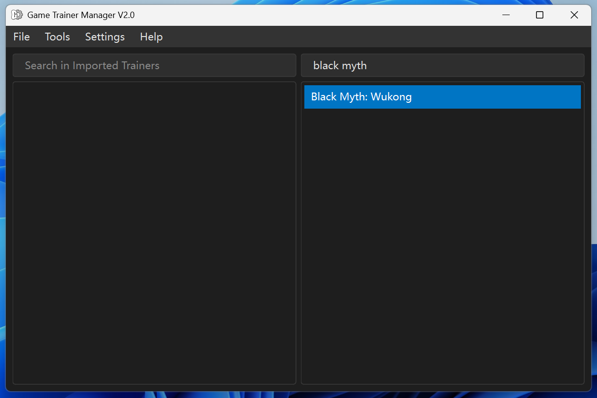

# Game Trainer Manager

English | [简体中文](./README_ZH.md)


**Game Trainer Manager** is a lightweight desktop application for managing `.exe` format game trainers. It provides downloading, importing, organizing, and searching capabilities with bilingual UI support (Simplified Chinese and English). Completely free and open-source (not for commercial use).

## Features

- **Trainer Management** — Import `.exe` files or compressed packages (`.zip`/`.rar`), delete trainers, open with one click
- **Pin to Top** — Right-click any trainer to pin/unpin it; pinned items appear at the top with highlighted background
- **Download & Auto-Import** — Browse and download trainers from FLiNG Trainer; monitor the download directory and automatically import new trainers once detected
- **Game Name Lookup** — Search game names in both Chinese and English; copy either name to clipboard via right-click
- **Filename Translation** — Batch-rename trainer filenames from English to Chinese based on the game name dictionary
- **Local Search** — Real-time fuzzy filtering of your imported trainers
- **Online Search** — Real-time fuzzy search of downloadable trainers from FLiNG Trainer catalog (supports abbreviations and Chinese-to-English lookup)
- **Steam Launcher** — One-click launch Steam (auto-detects installation path from registry)
- **Dual Theme** — Switch between dark and light themes from the Settings menu
- **Bilingual UI** — Toggle between Simplified Chinese and English in real-time (using gettext i18n)
- **Debug Mode** — Toggle debug output panel from the Settings menu to view detailed logs
- **GitHub Mirror Support** — Configure proxy/mirror URLs in `proxies.txt` to accelerate data updates
- **Lightweight & Portable** — Built with PySide6, single config file, CSV-based data storage



## Usage

The main window is divided into three panels, each with a search bar and a list:

| Panel | Description |
|---|---|
| **Local Trainers (left)** | Lists `.exe` files imported into the `trainers/` folder. Right-click to Open / Pin to Top / Unpin / Delete. Pinned items remain at the top after restart. |
| **Download (middle)** | Lists downloadable trainers from the FLiNG Trainer catalog. Right-click to open the download link in your browser or view the trainer's help page. |
| **Game Name Lookup (right)** | Lists game name pairs (Chinese + English). Type a name and press Enter to search; right-click to copy either the Chinese or English name to clipboard. |

**Importing Trainers:**
- Go to **File > Import Executable** or **File > Import Compressed File** to add trainers
- Set a download directory via **File > Set Download Directory**; after triggering a download via the middle panel, the app monitors this directory and auto-imports matching `.exe`/`.zip`/`.rar` files

**Translation:**
- Use **Tools > Translate Filenames** to batch rename all `.exe` files in `trainers/` folder to their Chinese game names

**Steam:**
- Click **Tools > Start Steam** to launch Steam with one click

**Data Updates:**
- The app auto-updates `trainers_list.csv`, `game_names_merged.csv`, and `abbreviation.csv` on startup if more than 2 days have passed since the last update
- Manually update via **File > Update Trainers List**
- If updates fail due to network issues, configure proxy/mirror URLs in **File > Modify GitHub File Acceleration**

**Theme & Language:**
- Switch themes (Dark/Light) or toggle UI language (Chinese/English) under the **Settings** menu — the app restarts automatically to apply changes

## Installation

You can get the software in two ways:

1. **Download the installer from Releases:**
   - Go to the [Releases](https://github.com/Karasukaigan/game-trainer-manager/releases) page and download the setup program.

2. **Clone the repository and run from source:**
   ```bash
   git clone https://github.com/Karasukaigan/game-trainer-manager.git
   cd game-trainer-manager
   python -m venv venv
   venv\Scripts\activate
   pip install -r requirements.txt
   python .\main.py
   ```

## Update Methods

Three data files need periodic updates:
- `trainers_list.csv` — trainer catalog from FLiNG Trainer
- `game_names_merged.csv` — Chinese-to-English game name mapping
- `abbreviation.csv` — game abbreviations and aliases

These files are located in `app/resources/`. Two update modes:

1. **Automatic Update** — `config.ini` records the last update timestamp. If more than 2 days have passed, the app fetches the latest files on startup.

2. **Manual Update** — Click **File > Update Trainers List** from the menu bar.

3. **GitHub Mirror** — If direct downloads fail due to network conditions, click **File > Modify GitHub File Acceleration** to edit `proxies.txt`. Each line is a mirror base URL; the app tries each in order with a 6-second timeout per node, falling back to the GitHub raw URL if none respond.

## Debug Mode

Toggle **Settings > Debug Mode** from the menu bar, or edit `config.ini` directly:
```
debugmode = true
```
The debug panel shows detailed operation logs at the bottom of the window.

## About the Official Version

The official version of Game Trainer Manager has removed the built-in crawler. When downloading trainers, the app opens the download link in your default browser rather than making direct HTTP requests. Trainer searches rely entirely on local CSV data, placing no extra load on FLiNG Trainer's servers.

## Disclaimer

This project is created by players voluntarily and has no association with FLiNG Trainer. Its design purpose is to manage game trainer files in any .exe format, including but not limited to those created by FLiNG Trainer. This software is completely free and open-source, and should not be used for commercial purposes. The software developers are not responsible for any losses caused by the use of this software.

This software respects the copyright of game trainer creators such as FLiNG Trainer, and will not make any modifications to the game trainer files except for renaming. It only provides management functions such as downloading, saving, and deleting.

Furthermore, users should bear the risks associated with downloading and using third-party game trainers. Please ensure that you comply with the relevant game's terms of use and service agreement when using trainers. Developers are not responsible for any consequences arising from violating game company policies.

This software is strictly prohibited from being used for any illegal purposes, including but not limited to violating game company policies, cheating, disrupting game balance, etc. Users should abide by relevant laws and regulations and game company policies when using this software to ensure a fair and legal gaming environment.
