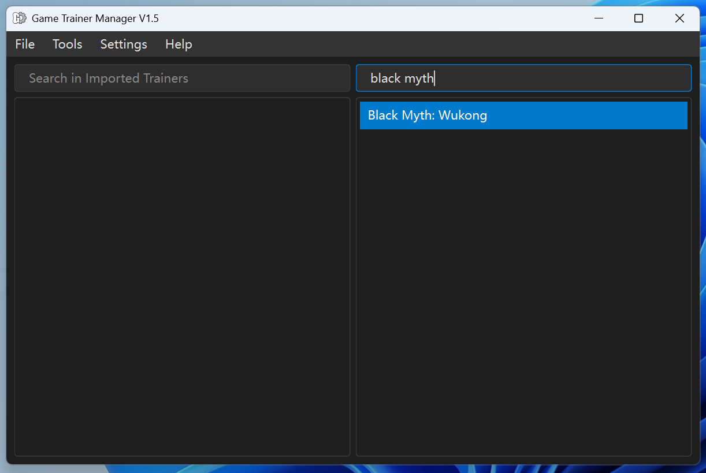

# Game Trainer Manager

English | [简体中文](./README_ZH.md)


**Game Trainer Manager** is a lightweight software designed for managing `.exe` format game trainer files. It provides functions for downloading, saving, deleting, and more. The application supports both Simplified Chinese and English languages. It is completely free and open-source (please do not use it for commercial purposes).

## Features

- Manage `.exe` format game trainers
- Download, save, and delete trainers
- Multi-language support (Simplified Chinese and English)
- Lightweight
- Free and open-source



## Installation

You can download the software in two ways:

1. **Directly from Releases:**
   - Go to the [Releases](https://github.com/Karasukaigan/game-trainer-manager/releases) section and download the installer.

2. **Clone the repository and run locally:**
   - Clone the repository to your local machine:
     ```bash
     git clone https://github.com/Karasukaigan/game-trainer-manager.git
     ```
   - Navigate to the project root directory and run the following commands:

     ```bash
     # Create a virtual environment named 'venv'
     python -m venv venv

     # Activate the virtual environment
     venv\Scripts\activate

     # Install the required dependencies
     pip install -r requirements.txt

     # Run the application
     python .\main.py
     ```

## Main Technology Stack

- **PyQt6**: Used to build the GUI framework.
- **requests + retrying + beautifulsoup4**: Used for updating.
- **gettext**: Used to implement multi-language UI pages.
- **PyInstaller**: Used to package Python programs into executable files.
- **Inno Setup**: Used for creating installation packages.

## Debug Mode

Locate the `config.ini` file in the project's root directory or the software's `_internal` directory, then change
```
debugmode = false
```
to
```
debugmode = true
```
to enable debug mode.