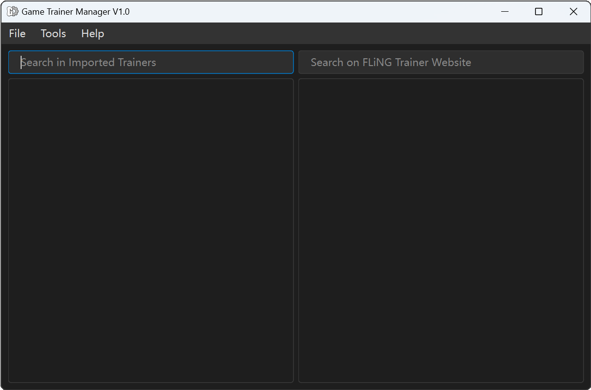

# Game Trainer Manager

[English](./README.md) | 简体中文


**Game Trainer Manager（游戏修改器管理器）** 是一个轻量化的软件，专门用于管理`.exe`格式的游戏修改器文件。它提供了下载、保存、删除等功能，支持简体中文和英文，完全免费且开源（请勿将其用于商业用途）。

## 功能特点

- 管理 `.exe` 格式的游戏修改器
- 下载、保存和删除修改器
- 将修改器文件名自动翻译成中文
- 多语言游戏名查询
- 多语言UI界面（简体中文和英文）
- 轻量化
- 免费和开源



## 安装方法

您可以通过以下两种方式下载软件：

1. **直接从 Releases 下载：**
   - 打开 [Releases（GitHub）](https://github.com/Karasukaigan/game-trainer-manager/releases) 或 [Releases（Gitee）](https://gitee.com/karasukaigan/game-trainer-manager/releases) 下载 `.exe` 格式的安装包。

2. **克隆存储库并在本地运行：**
   - 将存储库克隆到本地机器：
     ```bash
     git clone https://github.com/Karasukaigan/game-trainer-manager.git
     ```
   - 导航到项目根目录并运行以下命令：

     ```bash
     # 创建名为 'venv' 的虚拟环境
     python -m venv venv

     # 激活虚拟环境
     venv\Scripts\activate

     # 安装所需的依赖项
     pip install -r requirements.txt

     # 运行应用程序
     python .\main.py
     ```

## 主要技术栈

- **PyQt6**：用于构建GUI框架。
- **requests + retrying + beautifulsoup4**：用于获取更新。
- **gettext**：用于实现多语言的UI页面。
- **PyInstaller**：用于将Python程序打包成可执行文件。
- **Inno Setup**：用于制作安装包。

## 调试模式

在项目根目录或者软件的`_internal`目录里找到`config.ini`这个文件，然后将  
```
debugmode = false
```
改为  
```
debugmode = true
```
即可打开调试模式。  

## 免责声明

本项目为玩家自发制作，与FLiNG Trainer无关。其设计目的是用于管理包括但不限于FLiNG Trainer制作的任何.exe格式的游戏修改器文件。本软件完全免费且开源，请勿将其用于商业用途。使用本软件所造成的任何损失，软件开发者概不负责。  

本软件尊重FLiNG Trainer等游戏修改器制作方的版权，不会对游戏修改器文件进行除修改文件名之外的任何修改，仅提供下载、保存、删除等管理功能。  

此外，用户应自行承担下载和使用第三方游戏修改器所带来的风险。请确保您在使用修改器时遵守相关游戏的使用条款和服务协议。对于因违反游戏公司政策而导致的任何后果，开发者不承担责任。  

本软件严格禁止用于任何非法用途，包括但不限于违反游戏公司政策、作弊、破坏游戏平衡等行为。用户在使用本软件时应当遵守相关法律法规和游戏公司政策，以确保公平和合法的游戏环境。  
