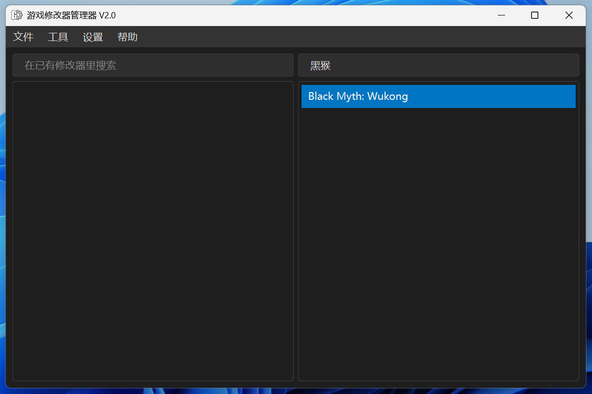

# 游戏修改器管理器

[English](./README.md) | 简体中文


**游戏修改器管理器（Game Trainer Manager）** 是一个轻量级的桌面应用，专门用于管理 `.exe` 格式的游戏修改器文件。它提供下载、导入、整理、搜索等功能，支持简体中文和英文双语界面。完全免费且开源（请勿用于商业用途）。

## 功能特点

- **修改器管理** — 导入 `.exe` 文件或压缩包（`.zip`/`.rar`），删除修改器，一键打开
- **置顶功能** — 右键修改器可置顶/取消置顶；置顶项显示在列表顶部，背景高亮；重启后保留置顶状态
- **下载与自动导入** — 浏览并下载 FLiNG Trainer 的修改器；监控下载目录，检测到新文件后自动导入
- **游戏名查询** — 同时搜索中英文游戏名；右键可复制中文名或英文名到剪贴板
- **文件名翻译** — 批量将 `trainers/` 目录下的 .exe 文件名翻译为对应的中文游戏名
- **本地搜索** — 实时模糊过滤已导入的修改器列表
- **在线搜索** — 实时模糊搜索可下载修改器（支持别名查询和中英文转换）
- **一键启动 Steam** — 自动从注册表检测 Steam 安装路径
- **双主题切换** — 支持深色/亮色主题，在设置菜单中一键切换
- **双语界面** — 实时切换简体中文和英文（基于 gettext 国际化）
- **调试模式** — 设置菜单中切换调试面板，查看详细操作日志
- **GitHub 镜像加速** — 在 `proxies.txt` 中配置镜像源地址，加速数据更新
- **轻量便携** — 基于 PySide6，单配置文件，CSV 格式数据存储



## 使用方法

主窗口分为三个面板，每个面板包含一个搜索框和一个列表：

| 面板 | 说明 |
|---|---|
| **本地修改器（左）** | 显示导入到 `trainers/` 文件夹的 `.exe` 文件。右键可打开 / 置顶 / 取消置顶 / 删除。置顶项在重启后仍保持在顶部。 |
| **下载列表（中）** | 显示 FLiNG Trainer 目录中的可下载修改器。右键可在浏览器中打开下载链接或查看说明页。 |
| **游戏名查询（右）** | 显示中英文游戏名对照。输入名称后按回车搜索；右键可复制中文名或英文名。 |

**导入修改器：**
- 通过菜单 **文件 > 导入修改器 (.exe)** 或 **文件 > 导入压缩包** 导入修改器
- 在 **文件 > 设置下载目录** 中指定下载路径；在中面板触发下载后，程序会自动监控该目录，检测到匹配的 `.exe`/`.zip`/`.rar` 文件后自动导入

**翻译文件名：**
- 点击 **工具 > 翻译文件名** 将 `trainers/` 目录下的 .exe 文件批量重命名为中文游戏名

**启动 Steam：**
- 点击 **工具 > 启动 Steam** 一键启动

**更新数据：**
- 启动时若距上次更新超过 2 天，自动更新 `trainers_list.csv`、`game_names_merged.csv`、`abbreviation.csv`
- 手动更新：**文件 > 更新修改器列表**
- 网络不佳时可通过 **文件 > 修改GitHub文件加速** 配置镜像源

**主题与语言：**
- 在 **设置** 菜单中切换深色/亮色主题或切换中/英文界面，应用会自动重启生效

## 安装方法

您可以通过以下两种方式获取软件：

1. **直接从 Releases 下载安装包：**
   - 打开 [Releases](https://github.com/Karasukaigan/game-trainer-manager/releases) 下载安装程序。

2. **克隆存储库并在本地运行：**
   ```bash
   git clone https://github.com/Karasukaigan/game-trainer-manager.git
   cd game-trainer-manager
   python -m venv venv
   venv\Scripts\activate
   pip install -r requirements.txt
   python .\main.py
   ```

## 更新方式

共有三个数据文件需要定期更新：
- `trainers_list.csv` — FLiNG Trainer 修改器目录
- `game_names_merged.csv` — 中英文游戏名映射
- `abbreviation.csv` — 游戏别名/简写

这些文件位于 `app/resources/` 目录中。有两种更新方式：

1. **自动更新** — `config.ini` 中记录了上次更新时间，超过 2 天未更新时启动自动获取最新文件。

2. **手动更新** — 点击菜单栏 **文件 > 更新修改器列表**。

3. **GitHub 镜像加速** — 如果直连下载失败，可点击 **文件 > 修改GitHub文件加速** 编辑 `proxies.txt`。每行一个镜像源URL，程序按顺序尝试连接（每节点 6 秒超时），全部失败后回退到 GitHub raw 地址。

## 调试模式

通过菜单栏 **设置 > Debug 模式** 切换，或直接修改 `config.ini`：
```
debugmode = true
```
开启后窗口底部会显示详细的操作日志面板。

## 关于正式版本

Game Trainer Manager 的正式版已移除内置爬虫功能。用户在下载修改器时，程序使用默认浏览器打开下载链接，而非直接发起 HTTP 请求。修改器搜索完全依赖本地 CSV 数据，不会对 FLiNG Trainer 的服务器造成额外负担。

## 免责声明

本项目为玩家自发制作，与FLiNG Trainer无关。其设计目的是用于管理包括但不限于FLiNG Trainer制作的任何.exe格式的游戏修改器文件。本软件完全免费且开源，请勿将其用于商业用途。使用本软件所造成的任何损失，软件开发者概不负责。

本软件尊重FLiNG Trainer等游戏修改器制作方的版权，不会对游戏修改器文件进行除修改文件名之外的任何修改，仅提供下载、保存、删除等管理功能。

此外，用户应自行承担下载和使用第三方游戏修改器所带来的风险。请确保您在使用修改器时遵守相关游戏的使用条款和服务协议。对于因违反游戏公司政策而导致的任何后果，开发者不承担责任。

本软件严格禁止用于任何非法用途，包括但不限于违反游戏公司政策、作弊、破坏游戏平衡等行为。用户在使用本软件时应当遵守相关法律法规和游戏公司政策，以确保公平和合法的游戏环境。
